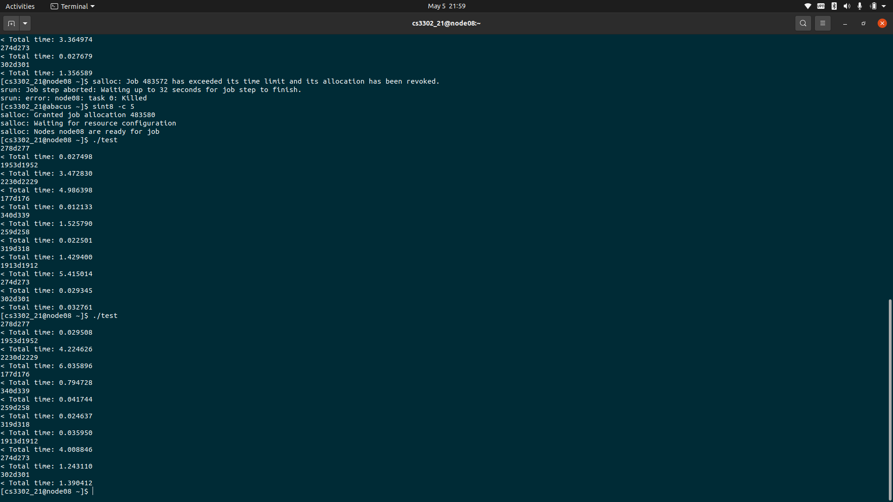
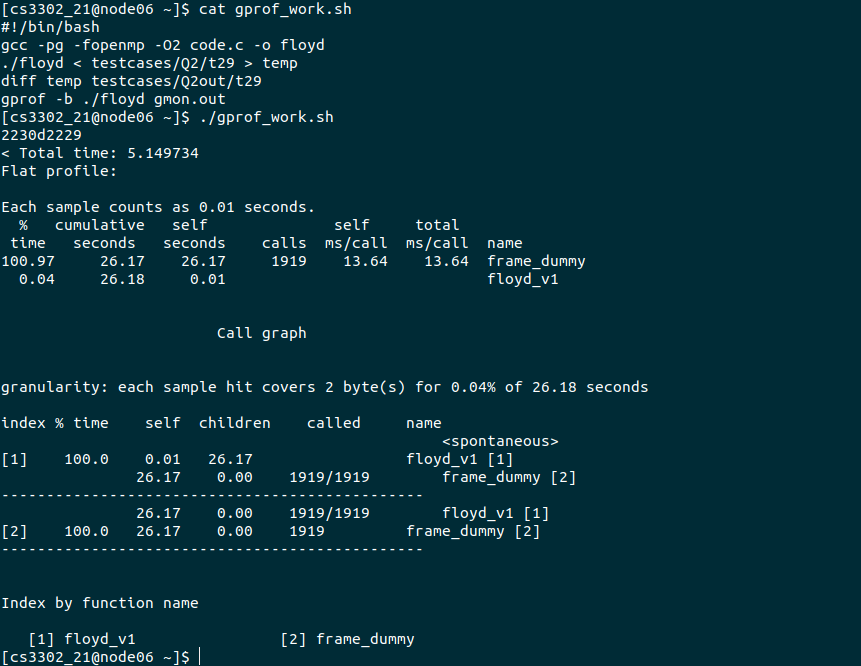
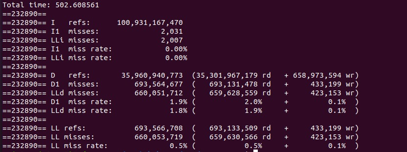

# SPP A2 | Floyd Warshal Optimization

* Ayush Sharma
* 2019101004


**Floyd–Warshall algorithm** is an algorithm for finding shortest paths in a directed weighted graph with positive or negative edge weights. A single execution of the algorithm will find the lengths of shortest paths between all pairs of vertices.


Floyd Warshall Algorithm
===

Floyd–Warshall algorithm is an algorithm for finding shortest paths in a directed weighted graph with positive or negative edge weights. A single execution of the algorithm will find the lengths of shortest paths between all pairs of vertices.

Optimizations
---

We were given 10 test cases out of which the largest was having `2229` number of nodes and `155317` number of edges. There can be self loop and multiple edges between same two nodes. Although I profiled all of them but will list timings and cache profile for that largest test case only. 

<I>Time taken</I> with the trivial algorithm i.e. no optimisation : `~63 seconds`

**My machine has total 8 cores**

Previous Version (i.e. in Assignment1)
---

Final Total time: 
* On Abacus : ~19.832843 (core independent as no multi-programming was there)
* ~15s on my machine

### Process for previous version optimisation

* Converted 2-D array for storing adjacency matrix into 1-D. Then for accessing `A[i][j]` we used pointer notation `(*(A + i*V + j))`, with keeping in mind the fact that generally 2-D matrices are stored in Row Major format in main memory.
* Pointer accesing to memory Restricted pointer access instead of array look-ups.
* Pre increment over post increment Pre-increment is faster than post-increment because post increment keeps a copy of previous (existing) value and adds 1 in the existing value while pre-increment is simply adds 1 without keeping the existing value.
* Used `register` keyword to reduce fetch time for `i`,`j`,`k` iterators which were being used more often.
* Used a temporary variable for storing and reducing memory lookup using pointers i.e. `register int * kmj = (matrix + k*V + j);` and `register int * imk = (matrix + i*V + k);`

* Tweaked the value of `INFINITY` to 1000000000.
* Removed spurious `if` conditions.
* Used more general memory lookup pointer variable i.e. replace `imk` & `kmj` with `im` and `km`. These new variable will be have more reads / writes ratio as compared to  `imk` & `kmj` .

```c

void floyd_v2(int * matrix, int V)
{
    register int i,j,k,kmj,imk, v;
    register int * km;
    register int * im;
    v = V;
    for(k=0;k<v;++k)
    {
        km = (matrix + k*v);
        for(i=0;i<v;++i)
        {
            im = (matrix + i*v);
            for(j=0;j+15<v;j+=16)
            {
                imk = (*(im + k));

                kmj = (*(km + j+0));
                if( ((im + j+0)) > ( kmj + imk ) ) ((im + j+0)) = ( kmj + imk );
                ...
                
                kmj = (*(km + j+15));
                if( ((im + j+15)) > ( kmj + imk ) ) ((im + j+15)) = ( kmj + imk );
            }
            while(j<v)
            {
                kmj = (*(km + j));
                imk = (*(im + k));
                if( ((im + j)) > ( kmj + imk ) ) ((im + j)) = ( kmj + imk );
                j++;
            }
        }
    }
}
```

Run time was reduced to `~19.8s` on Abacus.


Later Optimisation for Assignment2
---

* on Abacus with total core 4 : ~8.310297s (on average)
* on Abacus with total core 5 : ~6.212121s (on average)
* On my machine : ~5.6966s (on average)

### Process for multicore programming optimisation


The OpenMP API uses the fork-join model of parallel execution.
Multiple threads perform tasks defined implicitly or explicitly by
OpenMP directives. All OpenMP applications begin as a single thread
of execution, called the initial thread. The initial thread executes
sequentially, until it encounters a parallel construct. At that point,
this thread creates a group of itself and zero or more additional
threads and becomes the master thread of the new group. Each thread
executes the commands included in the parallel region, and their
execution may be differentiated, according to additional directives
provided by the programmer. At the end of the parallel region, all
threads are synchronized

```c


void floyd_v1(int * matrix, int V)
{
    register int i,j,k;
    for(k=0;k<V;++k)
    {
        register int* km = (matrix + k*V);

        #pragma omp parallel for private(j) shared(matrix,V)         
        
        for(i=0;i<V;++i)
        {
            register int* im = (matrix + i*V);
            
            for(j=0;j<V;++j)
            {
                if( (*(im + j)) > ( (*(im + k) ) + ( *(km + j) ) ) )
                    (*(im + j)) = ( (*(im + k) ) + ( *(km + j) ) );
            }
        }
    }
}

```

Final Result
---
On Abacus we get best running time to be `~5s` with our final code with core 5.





Profiling on abacus:

### `gprof`



### `Valgrind`

